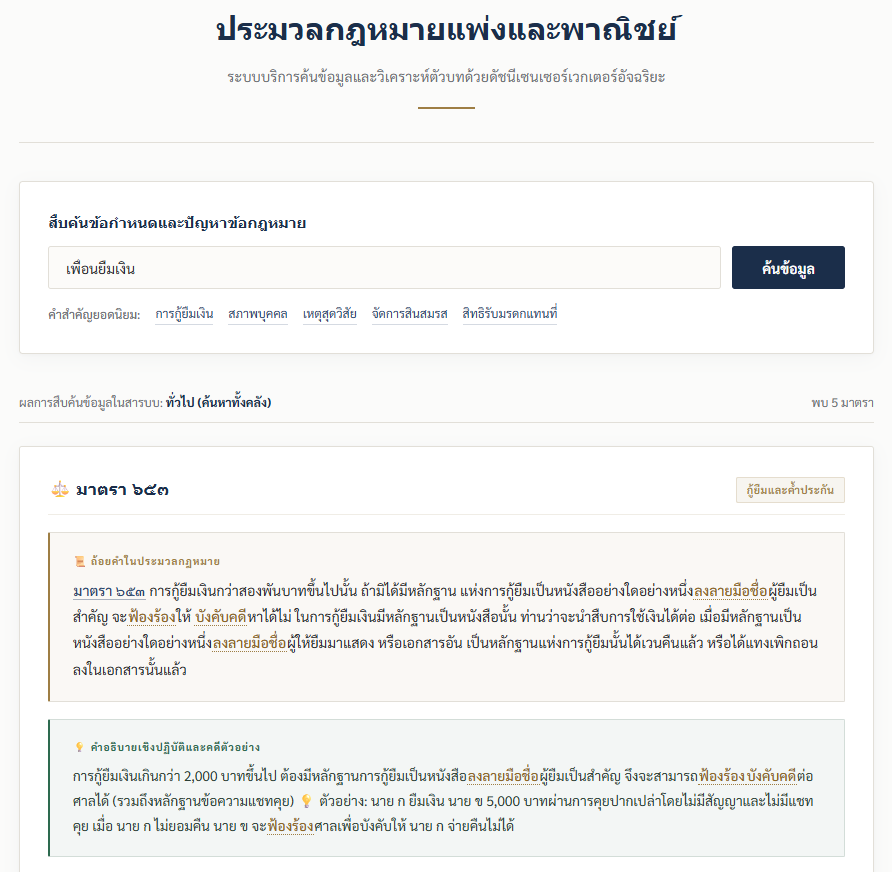
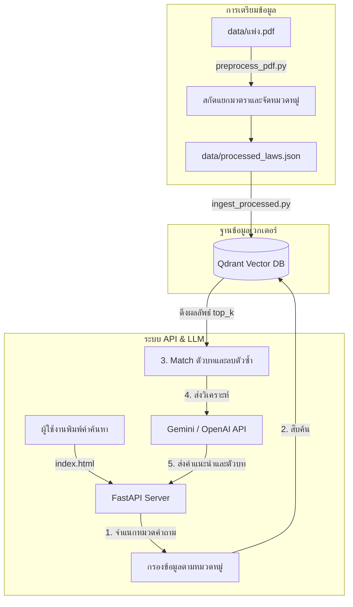

# RAG_civilLaw
ระบบค้นหาตัวบทกฎหมายและให้คำอธิบายประมวลกฎหมายแพ่งและพาณิชย์ของไทย

[](https://www.python.org/)
[](https://fastapi.tiangolo.com/)
[](https://www.llamaindex.ai/)
[](https://qdrant.tech/)
[](https://mlflow.org/)
[](https://ai.google.dev/)
[](https://www.docker.com/)

ระบบค้นหามาตรากฎหมายแพ่งและพาณิชย์ ทำงานร่วมกับฐานข้อมูลเวกเตอร์แบบออฟไลน์ (Local Vector Database) เพื่อดึงมาตราที่เกี่ยวข้องขึ้นมาแสดงผลคู่กับคำอธิบาย และสามารถส่งต่อข้อมูลให้โมเดลภาษา (LLM) เช่น Google Gemini API (หรือ OpenAI / DeepSeek สำรอง) ช่วยสรุปวิเคราะห์เป็นคำแนะนำการปฏิบัติตัวได้

*หมายเหตุ: โครงการนี้ไม่ได้รวบรวมไฟล์คลังข้อมูลกฎหมายตัวเต็มมาให้ใน Repository เพื่อความเป็นระเบียบและติดเงื่อนไขการเผยแพร่ข้อมูลลิขสิทธิ์ อย่างไรก็ตามระบบรองรับระบบจำลองข้อมูลเริ่มต้นทำงานทันทีหลังโคลน (Zero-Configuration Demo Mode) ซึ่งจะอธิบายวิธีเริ่มใช้งานไว้อย่างละเอียดด้านล่างนี้*

---

## 📸 ตัวอย่างหน้าตาโปรแกรม (User Interface)



---

## คุณสมบัติ

1. **AI Legal Assistant (ผู้ช่วยวิเคราะห์กฎหมาย):**
   * ระบบสามารถต่อท่อเชื่อมกับ **Google Gemini API** (โมเดล `gemini-2.0-flash`) เพื่อนำคำถามของผู้ใช้และมาตราที่สืบค้นได้ไปร่วมวิเคราะห์
   * AI จะสรุปตัวบทกฎหมายที่ยาวและซับซ้อนให้เข้าใจง่ายในภาษาพูดของคนทั่วไป พร้อมให้คำแนะนำวิธีปฏิบัติตัวเชิงกฎหมาย (เช่น สิทธิ์การฟ้องร้อง และการเตรียมพยานหลักฐานต่างๆ)
   * รองรับระบบสำรอง (Graceful Fallback) ไปยัง **OpenAI** (`gpt-4o-mini`) หรือ **DeepSeek** (`deepseek-chat`) อัตโนมัติหาก API คีย์หลักมีปัญหา

2. **Intent-based Scoped Retrieval (กรองมาตราตรงหมวดหมู่):** 
   * ตรวจจับความตั้งใจของผู้ถามเบื้องต้น (เช่น พิมพ์คีย์เวิร์ดเกี่ยวกับ หย่า บุตร สมรส จะกรองเข้าหมวดครอบครัว) เพื่อกรองมาตราที่จะดึงจาก Qdrant ให้ตรงหมวดหมู่มากที่สุด ป้องกันปัญหาระบบหลงไปดึงคำพ้องเสียงหรือคำใกล้เคียงที่อยู่ผิดหมวด

3. **Deduplication (ระบบคัดกรองมาตราซ้ำ):**
   * ตัดประเด็นการแสดงผลมาตราซ้ำซ้อนที่อาจเกิดจากการดึงชิ้นส่วนข้อความ (Chunk) หลายข้อความจากมาตราเดียวกัน ทำให้การสืบค้นแสดงมาตรากฎหมายอื่นที่เกี่ยวข้องเพิ่มขึ้น

4. **Judicial UI Design (การจัดวางสไตล์ราชการ):**
   * ออกแบบหน้าเว็บโทนสีกรมท่า-ขอบทองครีม สบายตา สไตล์ทางการ พร้อมระบบลิ้นชักแสดงผล (Sliding Drawer) เมื่อต้องการเปิดดูเนื้อหามาตราอ้างอิงย่อยด้านขวาของหน้าต่างหลัก

5. **Fail-safe Mode (โหมดจำลองสถานะออฟไลน์):**
   * ตรวจวัดสถานะการเชื่อมต่อหลังบ้าน (FastAPI Health Check) ภายใน 2.5 วินาที หากเซิร์ฟเวอร์ยังไม่เปิด ระบบจะสลับเข้าสู่โหมดจำลอง (Offline Demo Mode) ให้ผู้ใช้กดทดลองค้นหาข้อมูลสาธิตในเครื่องได้ทันทีเพื่อป้องกันหน้าเว็บค้าง

---

## 🏗️ แผนผังโครงสร้างการทำงาน (System Flow)



---

## 🛠️ รายการเทคโนโลยีหลัก (Tech Stack)

* **RAG Framework:** [LlamaIndex](https://github.com/run-llama/llama_index)
* **LLM Engine:** Google Gemini SDK (`google-generativeai`)
* **Vector DB:** [Qdrant](https://qdrant.tech/) (ใน Docker Container)
* **Embedding Model:** `intfloat/multilingual-e5-small` (ดาวน์โหลดใช้ในเครื่อง)
* **Web Framework:** [FastAPI](https://fastapi.tiangolo.com/) และ Uvicorn
* **Frontend:** Vanilla HTML, CSS และ JavaScript

---

## 🚀 คู่มือขั้นตอนการเริ่มใช้งานโปรเจกต์อย่างละเอียด (How to Setup & Run)

เมื่อท่านทำการโคลนโปรเจกต์นี้จาก GitHub ไปใช้งาน มีขั้นตอนที่ต้องจัดเตรียมและเริ่มระบบทั้งหมดดังนี้:

### 1. โคลนและเปิดโฟลเดอร์โครงการ
ใช้ Git ในการดึงซอร์สโค้ดของโปรเจกต์:
```bash
git clone https://github.com/Name-RT/RAG_civilLaw.git
cd RAG_civilLaw
```

### 2. สตาร์ทฐานข้อมูลเวกเตอร์ (Vector Database)
โปรเจกต์นี้ใช้ **Qdrant** ในการเก็บเวกเตอร์และทำ Semantic Search ท่านจำเป็นต้องใช้ **Docker Desktop** ในการจำลองฐานข้อมูลขึ้นมา โดยพิมพ์คำสั่งนี้ในหน้าต่าง Terminal/Command Prompt:
```bash
docker-compose up -d
```
*การตรวจสอบ: เข้าไปที่บราวเซอร์แล้วกดเปิดหน้า `http://localhost:5000` (MLflow สำหรับดูระบบบันทึกความคืบหน้า) และ `http://localhost:6333/dashboard` (Qdrant Dashboard) หากเข้าดูได้แสดงว่าฐานข้อมูลเวกเตอร์เปิดบริการเรียบร้อยแล้ว*

### 3. ติดตั้งไลบรารีและสภาพแวดล้อมภาษา Python
แนะนำให้ใช้ **Conda** ในการสร้าง Environment ป้องกันไลบรารีชนกับโปรเจกต์อื่น:
```bash
# 1. สร้างสภาพแวดล้อมจำลองใหม่สำหรับ Python 3.10
conda create -n rag-civillaw python=3.10 -y

# 2. เปิดใช้งานกล่องสภาพแวดล้อม
conda activate rag-civillaw

# 3. ติดตั้งโมเดลและไลบรารี RAG ทั้งหมดที่ระบุในรายการไฟล์ติดตั้ง
pip install -r requirements.txt
```
*(เมื่อลงไลบรารีเรียบร้อย ในการเปิดรันครั้งแรกระบบจะดาวน์โหลดโมเดล `intfloat/multilingual-e5-small` ขนาดเล็กเพียง ~120MB ลงมาเก็บไว้ในเครื่องเพื่อประมวลผลคำแปลเวกเตอร์แบบออฟไลน์)*

### 4. จัดเตรียมคีย์ API สำหรับผู้ช่วยวิเคราะห์ AI (.env)
สร้างไฟล์ชื่อ `.env` ไว้ที่โฟลเดอร์นอกสุดของโปรเจกต์ (ระดับเดียวกับ `main.py`) และระบุ API Key ของท่าน:
```env
GEMINI_API_KEY=AIzaSy... (ระบุคีย์ Google Gemini ที่ได้จาก Google AI Studio)
# ตัวเลือกเสริมสำหรับการทำระบบวิเคราะห์คดีแบบสลับสำรอง (Fallback)
OPENAI_API_KEY=sk-...
DEEPSEEK_API_KEY=sk-...
```

### 5. การจัดการไฟล์ข้อมูลดิบและระบบจำลองเริ่มต้น (Database & Auto-Ingestion)

> [!IMPORTANT]
> **ระบบรองรับการรันทันทีหลังโคลน (Zero-Configuration Demo Mode)**
> ไฟล์ประมวลกฎหมายตัวเต็มไม่ได้ถูกบันทึกขึ้น GitHub เนื่องจากติดเงื่อนไขการเผยแพร่ลิขสิทธิ์ข้อมูล อย่างไรก็ตาม ทันทีที่ท่านสตาร์ทโปรแกรมหลังบ้านเป็นครั้งแรกด้วยคำสั่ง `python main.py` ระบบจะตรวจสอบโฟลเดอร์อัตโนมัติ หากไม่พบฐานข้อมูลระบบจะสร้างโฟลเดอร์เก็บข้อมูล `data/` และสร้างคลังกฎหมายตัวอย่าง `data/processed_laws.json` (มีมาตรา 15, 21, 420, 653, 1304) พร้อมทำเวกเตอร์นำเข้าฐานข้อมูล Qdrant ให้เองทันที เพื่อให้ท่านพร้อมพิมพ์ค้นหาและส่งทดสอบให้ AI ประเมินได้โดยไม่ต้องมีข้อมูลดิบมาก่อน!

**การนำเข้าข้อมูลกฎหมายจริงของท่านเอง:**
หากท่านมีไฟล์คลังกฎหมายของตนเอง ให้สร้างโฟลเดอร์ชื่อ `data` และบันทึกไฟล์ในรูปแบบชื่อ `processed_laws.json` โดยจัดโครงสร้างข้อมูลตามรูปแบบ **JSON Schema** ที่แจ้งไว้ในส่วนท้ายสุดของคู่มือนี้ เมื่อวางไฟล์แล้วให้เปิดโปรแกรมในโฟลเดอร์ `main.py` ระบบจะดึงฐานข้อมูลตัวเต็มของท่านไปประมวลผลเวกเตอร์เก็บลง Qdrant ใหม่ทันที

### 6. เริ่มการทำงานหลังบ้านและเปิดหน้าต่างเว็บแอป
1. รัน API เซิร์ฟเวอร์ใน Command Prompt/Terminal:
   ```bash
   python main.py
   ```
   *(รอจนหน้าจอแสดงสถานะ Uvicorn running on http://127.0.0.1:8000)*
2. ดับเบิ้ลคลิกเปิดไฟล์ `index.html` บนเบราว์เซอร์ของท่านเพื่อเข้าใช้งานและทดลองสืบค้นความเห็น AI ได้ทันที!

---

## 📁 โครงสร้างไฟล์ในโฟลเดอร์ของโปรเจกต์ (Project Structure)

โครงสร้างโฟลเดอร์โครงการสำหรับการเริ่มต้นใช้งานและรันระบบ:

```
RAG_civilLaw/
│
├── data/
│   ├── processed_laws_template.json # ไฟล์จำลองข้อมูลกฎหมายเริ่มต้น
│   └── processed_laws.json     # ไฟล์คลังฐานข้อมูลกฎหมาย (สร้างอัตโนมัติเมื่อรันครั้งแรก)
│
├── docker-compose.yml          # คอนฟิกรัน Container สำหรับฐานข้อมูลเวกเตอร์ Qdrant
├── requirements.txt            # รายการไลบรารีที่ต้องใช้ในการติดตั้ง
├── ตัวอย่าง.png                  # รูปภาพแสดงตัวอย่างหน้าจอผู้ใช้ของแอปพลิเคชัน
├── .env                        # ไฟล์เก็บคีย์ API (สำหรับระบุ GEMINI_API_KEY)
├── .gitignore                  # ตัวกำหนดละเว้นไฟล์ประวัติ/ข้อมูลขนาดใหญ่ของ Git
│
├── utils.py                    # ส่วนจัดการตัวแปรและฟังก์ชันช่วยเหลือ (หมวดหมู่/เช็คคำอธิบาย)
├── database.py                 # ส่วนจัดการ Qdrant Vector Database
├── llm_service.py              # ส่วนควบคุมโมเดล AI (Gemini, OpenAI, DeepSeek)
├── main.py                     # ส่วนประมวลผลเซิร์ฟเวอร์หลังบ้าน (FastAPI Router)
├── index.html                  # หน้าเว็บแอปพลิเคชันสำหรับสืบค้น
└── README.md                   # คู่มือการใช้งานโปรเจกต์
```

---

## 📄 โครงสร้างและรูปแบบข้อมูลของไฟล์ฐานข้อมูลกฎหมาย (JSON Schema)

ไฟล์คลังประมวลกฎหมาย `data/processed_laws.json` เก็บข้อมูลในรูปแบบ Array of Objects โดยแต่ละชุดประกอบด้วยมาตรา หมวดหมู่ ตัวบทกฎหมายดั้งเดิม และคำอธิบายความหมายย่อยในภาษาพูดทั่วไป ตามตัวอย่างด้านล่างนี้:

```json
[
  {
    "section": "มาตรา ๑๕",
    "category": "บุคคลและความสามารถทางกฎหมาย",
    "original_text": "สภาพบุคคลย่อมเริ่มแต่เมื่อคลอดแล้วอยู่รอดเป็นทารก และสิ้นสุดลงเมื่อตาย",
    "simplified_text": "สภาพความเป็นบุคคลเริ่มต้นตั้งแต่เวลาที่เราเกิดมาและรอดชีวิต และจะสิ้นสุดลงเมื่อเราเสียชีวิต"
  },
  {
    "section": "มาตรา ๖๕๓",
    "category": "กู้ยืมและค้ำประกัน",
    "original_text": "การกู้ยืมเงินกว่าสองพันบาทขึ้นไปนั้น หากมิได้มีหลักฐานเป็นหนังสืออย่างใดอย่างหนึ่งลงลายมือชื่อผู้ยืมเป็นสำคัญ จะฟ้องร้องบังคับคดีหาได้ไม่",
    "simplified_text": "หากกู้ยืมเงินกันเกินกว่า 2,000 บาทขึ้นไป จะต้องมีหลักฐานการกู้เงินเป็นหนังสือหรือลายลักษณ์อักษรที่ลงลายมือชื่อผู้ยืม จึงจะสามารถใช้ฟ้องร้องดำเนินคดีตามกฎหมายได้"
  }
]
```
