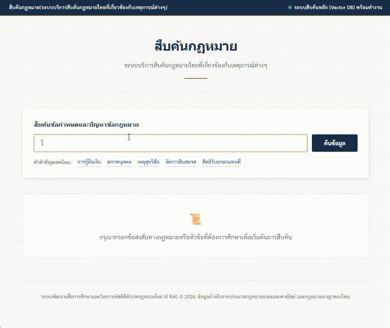
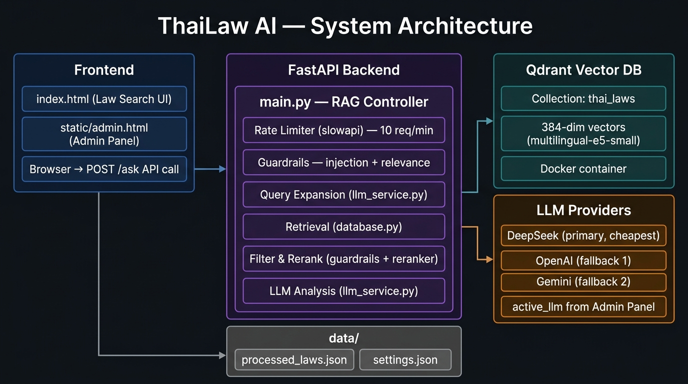
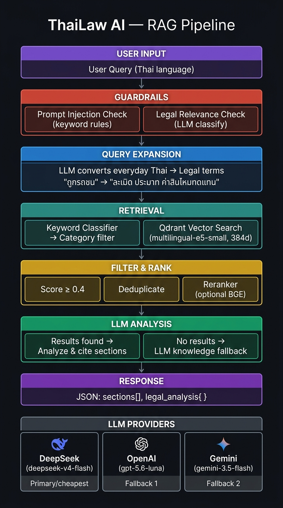

# ⚖️ ThaiLaw AI

> ระบบค้นหาและวิเคราะห์กฎหมายไทย (ประมวลกฎหมายแพ่ง + อาญา) ด้วย RAG + LLM  
> รองรับ DeepSeek · OpenAI · Google Gemini — สลับได้จาก Admin Panel ไม่ต้อง restart


---

## 📋 สารบัญ

- [ภาพรวมระบบ](#-ภาพรวมระบบ)
- [System Architecture](#-system-architecture)
- [RAG Pipeline](#-rag-pipeline)
- [โครงสร้างไฟล์](#-โครงสร้างไฟล์)
- [การติดตั้ง (Quick Start)](#-การติดตั้ง-quick-start)
- [การตั้งค่า Environment](#-การตั้งค่า-environment)
- [วิธีรันระบบ](#-วิธีรันระบบ)
- [API Reference](#-api-reference)
- [Admin Panel](#-admin-panel)
- [การปรับแต่งขั้นสูง](#-การปรับแต่งขั้นสูง)

---

## 🎥 Video Demo



---
## 🌐 ภาพรวมระบบ

ThaiLaw AI ช่วยให้ประชาชนทั่วไปสามารถถามคำถามกฎหมายเป็น **ภาษาพูดธรรมดา** แล้วได้รับคำแนะนำพร้อมอ้างอิงมาตราจากฐานข้อมูลกฎหมายจริง

**ตัวอย่าง:**
- ถาม: *"เพื่อนยืมเงินไม่คืน ทำอย่างไรดี?"*
- ระบบค้น: **มาตรา ๖๕๓, ๑๙๔** (กู้ยืม, หนี้และการชำระหนี้)
- AI ตอบ: คำแนะนำขั้นตอน + หลักฐานที่ต้องเตรียม

---

## 🏗️ System Architecture



| Component | เทคโนโลยี | หน้าที่ |
|-----------|-----------|--------|
| **Frontend** | Vanilla HTML/CSS/JS | หน้าค้นหา + Admin Panel |
| **Backend** | FastAPI + Uvicorn | API server + RAG controller |
| **Vector DB** | Qdrant (Docker) | เก็บ embedding กฎหมาย 384d |
| **Embedding** | multilingual-e5-small | แปลงข้อความ → vector |
| **LLM** | DeepSeek / OpenAI / Gemini | Query Expansion + Analysis |
| **Reranker** | BGE-Reranker-v2-m3 | จัดอันดับผลลัพธ์ (optional) |

---

## 🔄 RAG Pipeline



### LLM Priority Routing

| Provider | Model | ราคา | เหมาะกับ |
|----------|-------|------|---------|
| 🐋 **DeepSeek** | `deepseek-v4-flash` | ถูกสุด ⭐ | งานทั่วไป (แนะนำ) |
| 🤖 **OpenAI** | `gpt-5.6-luna` | กลาง | งานทั่วไป |
| ✨ **Gemini** | `gemini-3.5-flash` | กลาง | งานทั่วไป |

---

## 📁 โครงสร้างไฟล์

```
thai-law-ai/
│
├── 📄 main.py              # FastAPI app + RAG pipeline controller
├── 📄 config.py            # ค่าคงที่ทั้งหมด (models, paths, defaults)
├── 📄 database.py          # Qdrant connection + Vector indexing
├── 📄 llm_service.py       # Query Expansion + LLM Analysis
├── 📄 guardrails.py        # Security: injection + relevance + score filter
├── 📄 admin.py             # Admin API (settings, law data management)
├── 📄 utils.py             # Keyword classifier + text utilities
├── 📄 reranker.py          # BGE CrossEncoder reranker (optional)
├── 📄 ingest_processed.py  # นำเข้าข้อมูลกฎหมายจาก JSON → Qdrant
├── 📄 scrape_laws.py       # ดึงข้อมูลกฎหมายจาก lawonline.go.th
│
├── 📄 index.html           # หน้าค้นหากฎหมาย (Frontend)
├── 📄 requirements.txt     # Python dependencies
├── 📄 docker-compose.yml   # รัน Qdrant ด้วย Docker
├── 📄 .env                 # API Keys (ไม่ commit ขึ้น Git)
│
├── 📁 static/
│   └── admin.html          # หน้า Admin Panel (serve ที่ /admin)
│
├── 📁 docs/
│   ├── pipeline.jpg        # RAG Pipeline diagram
│   └── architecture.jpg    # System Architecture diagram
│
└── 📁 data/
    ├── processed_laws.json  # ข้อมูลกฎหมายที่ประมวลผลแล้ว
    └── settings.json        # การตั้งค่าระบบ (สร้างอัตโนมัติ)
```

### Module Dependencies

- `main.py` เรียกใช้ฟังก์ชันหลักจาก `database.py`, `llm_service.py`, `guardrails.py`, และ `utils.py`
- การตั้งค่าส่วนใหญ่จะดึงมาจาก `config.py`
- `admin.py` ใช้จัดการข้อมูลและทำงานร่วมกับ `reranker.py`

---

## ⚡ การติดตั้ง (Quick Start)

### Prerequisites

- Python 3.10+
- Docker Desktop
- API Key จาก DeepSeek / OpenAI / Gemini อย่างน้อย 1 ตัว

### 1. Clone repository

```bash
git clone https://github.com/your-username/thai-law-ai.git
cd thai-law-ai
```

### 2. สร้าง virtual environment

```bash
# ด้วย conda
conda create -n thai-law python=3.10
conda activate thai-law

# หรือด้วย venv
python -m venv venv
venv\Scripts\activate     # Windows
source venv/bin/activate  # Linux/Mac
```

### 3. ติดตั้ง dependencies

```bash
pip install -r requirements.txt
```

### 4. รัน Qdrant ด้วย Docker

```bash
docker-compose up -d
```

> ✅ ตรวจสอบ: http://localhost:6333/dashboard

### 5. ตั้งค่า API Keys

```bash
cp .env.example .env
# แก้ไข .env ใส่ API keys
```

### 6. นำเข้าข้อมูลกฎหมาย

```bash
python ingest_processed.py
```

### 7. รัน Server

```bash
python main.py
```

เปิด **http://127.0.0.1:8000** ✅

---

## 🔑 การตั้งค่า Environment

สร้างไฟล์ `.env` ที่ root ของโปรเจกต์:

```env
# ใส่อย่างน้อย 1 ตัว — ระบบจะ fallback อัตโนมัติถ้าตัวแรกล้มเหลว

# DeepSeek (แนะนำ: ราคาถูกที่สุด)
DEEPSEEK_API_KEY=sk-xxxxxxxxxxxxxxxx

# Google Gemini
GEMINI_API_KEY=AIzaxxxxxxxxxxxxxxxx

# OpenAI
OPENAI_API_KEY=sk-xxxxxxxxxxxxxxxx
```

> ⚠️ **.env ถูกกั้นโดย .gitignore แล้ว — อย่า commit ขึ้น Git เด็ดขาด**

---

## 🚀 วิธีรันระบบ

```bash
# รัน server
python main.py

# รัน dev mode พร้อม auto-reload
uvicorn main:app --reload

# ดู API docs (Swagger UI)
open http://127.0.0.1:8000/docs
```

---

## 📡 API Reference

### `POST /ask` — ค้นหาและวิเคราะห์กฎหมาย

**Request:**
```json
{
  "query": "เพื่อนยืมเงินไม่คืนทำอย่างไร",
  "top_k": 5
}
```

**Response:**
```json
{
  "query": "เพื่อนยืมเงินไม่คืนทำอย่างไร",
  "detected_category": "กู้ยืมและค้ำประกัน",
  "found": 3,
  "results": [
    {
      "rank": 1,
      "score": 0.82,
      "section": "มาตรา ๖๕๓",
      "category": "กู้ยืมและค้ำประกัน",
      "original_text": "การกู้ยืมเงินกว่าสองพันบาทขึ้นไป...",
      "simplified_text": "ถ้าจะฟ้องหนี้เกิน 2,000 บาท ต้องมีหลักฐาน..."
    }
  ],
  "legal_analysis": {
    "has_analysis": true,
    "relevant_sections": "มาตรา ๖๕๓, มาตรา ๑๙๔",
    "general_meaning": "กฎหมายกำหนดว่า...",
    "recommendation": "คุณควรดำเนินการดังนี้..."
  }
}
```

### `GET /section/{num}` — ดูตัวบทมาตรา

```bash
GET /section/420     # เลขอารบิก
GET /section/๔๒๐    # เลขไทย
```

### `GET /health` — ตรวจสอบสถานะ

```json
{ "status": "OK", "database_connected": true }
```

### Admin API

| Method | Path | คำอธิบาย |
|--------|------|---------|
| `GET` | `/api/admin/settings` | ดูการตั้งค่าปัจจุบัน |
| `POST` | `/api/admin/settings` | แก้ไขการตั้งค่า |
| `POST` | `/api/admin/sync` | Sync ข้อมูลจาก HuggingFace |
| `GET` | `/api/admin/laws` | ค้นหารายการกฎหมาย |
| `PUT` | `/api/admin/laws` | แก้ไขข้อมูลกฎหมาย |

---

## 🛠️ Admin Panel

เปิด **http://127.0.0.1:8000/admin**

| การตั้งค่า | ค่าเริ่มต้น | คำอธิบาย |
|-----------|------------|---------|
| `active_llm` | `deepseek` | เลือก LLM หลัก |
| `top_k` | `5` | จำนวนมาตราที่แสดง |
| `similarity_threshold` | `0.4` | คะแนนต่ำสุดที่ยอมรับ |
| `use_reranker` | `false` | เปิด BGE Reranker |
| `chunk_size` | `512` | ขนาด chunk เมื่อ ingest |

---

## 🔧 การปรับแต่งขั้นสูง

### เปลี่ยน Embedding Model

แก้ไข `config.py`:
```python
EMBED_MODEL_NAME = "intfloat/multilingual-e5-large"
EMBED_DIM        = 1024
```
> ⚠️ ถ้าเปลี่ยนโมเดล ต้อง **ลบ Qdrant collection และ ingest ใหม่**

### เปิด Reranker

ใน Admin Panel ตั้ง `use_reranker = true`  
โมเดล `BAAI/bge-reranker-v2-m3` จะโหลดอัตโนมัติ

### เพิ่มหมวดหมู่กฎหมาย

แก้ไข `utils.py` → `CATEGORY_KEYWORDS`:
```python
CATEGORY_KEYWORDS = [
    ("ชื่อหมวด", ["keyword1", "keyword2"]),
    # เพิ่ม tuple ใหม่ที่นี่
]
```

---

## 📦 Dependencies หลัก

| Package | วัตถุประสงค์ |
|---------|------------|
| `fastapi` | Web framework |
| `uvicorn` | ASGI server |
| `qdrant-client` | Vector DB client |
| `llama-index` | RAG framework |
| `sentence-transformers` | Embedding + Reranker |
| `openai` | DeepSeek / OpenAI client |
| `google-generativeai` | Gemini client |
| `slowapi` | Rate limiting |
| `python-dotenv` | Environment variables |

---

## ⚠️ คำเตือนทางกฎหมาย

> ThaiLaw AI เป็นเครื่องมือค้นหาข้อมูลกฎหมายเบื้องต้นเท่านั้น  
> **ไม่ใช่คำปรึกษาทางกฎหมายที่มีผลผูกพัน**  
> สำหรับคดีความจริง โปรดปรึกษาทนายความที่ได้รับใบอนุญาต

---

## 📄 License

MIT License
