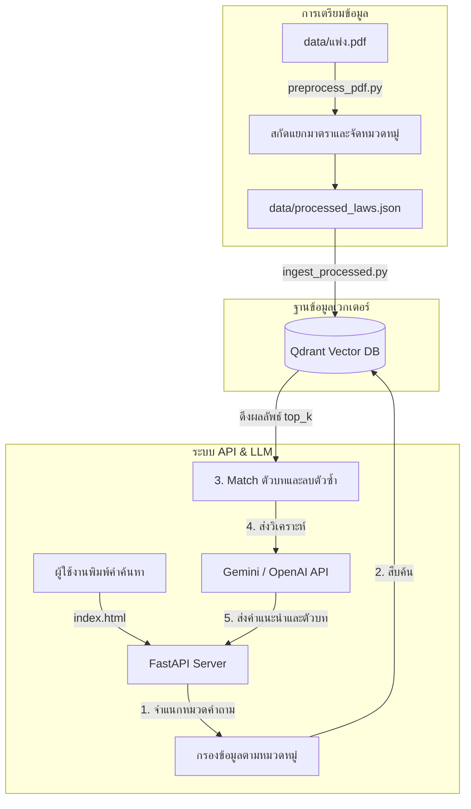

# LegalShield AI (RAG Civil Law)
ระบบค้นหาตัวบทกฎหมายและให้คำอธิบายประมวลกฎหมายแพ่งและพาณิชย์ของไทย

ระบบผู้ช่วยค้นหามาตรากฎหมายแพ่งและพาณิชย์ (ครอบคลุม 2,674 มาตรา) ทำงานร่วมกับฐานข้อมูลเวกเตอร์แบบออฟไลน์ (Local Vector Database) เพื่อดึงมาตราที่เกี่ยวข้องขึ้นมาแสดงผลคู่กับคำอธิบาย และสามารถต่อท่อข้อมูลส่งให้โมเดลภาษา (LLM) เช่น Google Gemini API (หรือ OpenAI / DeepSeek สำรอง) ช่วยสรุปวิเคราะห์เป็นคำแนะนำการปฏิบัติตัวสำหรับบุคคลทั่วไปได้ทันที

---

## 📸 ตัวอย่างหน้าตาโปรแกรม (User Interface)


---

## 🌟 คุณสมบัติเด่น (Core Features)

1. **AI Legal Assistant (ผู้ช่วยวิเคราะห์กฎหมาย):**
   * ระบบสามารถต่อท่อเชื่อมกับ **Google Gemini API** (โมเดล `gemini-2.0-flash`) เพื่อนำคำถามของผู้ใช้และมาตราที่สืบค้นได้ไปร่วมวิเคราะห์
   * AI จะสรุปตัวบทกฎหมายที่ยาวและซับซ้อนให้เข้าใจง่ายในภาษาพูดของคนทั่วไป พร้อมให้คำแนะนำวิธีปฏิบัติตัวเชิงกฎหมาย (เช่น สิทธิ์การฟ้องร้อง และการเตรียมพยานหลักฐานต่างๆ)
   * รองรับระบบสำรอง (Graceful Fallback) ไปยัง **OpenAI** (`gpt-4o-mini`) หรือ **DeepSeek** (`deepseek-chat`) อัตโนมัติหาก API คีย์หลักมีปัญหา

2. **Intent-based Scoped Retrieval (กรองมาตราตรงหมวดหมู่):** 
   * ตรวจจับความตั้งใจของผู้ถามเบื้องต้น (เช่น พิมพ์คีย์เวิร์ดเกี่ยวกับ หย่า บุตร สมรส จะกรองเข้าหมวดครอบครัว) เพื่อกรองมาตราที่จะดึงจาก Qdrant ให้ตรงหมวดหมู่มากที่สุด ป้องกันปัญหาระบบหลงไปดึงคำพ้องเสียงหรือคำใกล้เคียงที่อยู่ผิดหมวด

3. **Deduplication (ระบบคัดกรองมาตราซ้ำ):**
   * ตัดประเด็นการแสดงผลมาตราซ้ำซ้อนที่อาจเกิดจากการดึงชิ้นส่วนข้อความ (Chunk) หลายข้อความจากมาตราเดียวกัน ทำให้การสืบค้นแสดงมาตรากฎหมายอื่นที่เกี่ยวข้องเพิ่มขึ้น

4. **Judicial UI Design (การจัดวางสไตล์ราชการ):**
   * ออกแบบหน้าเว็บโทนสีกรมท่า-ขอบทองครีม สบายตา สไตล์ทางการ พร้อมระบบลิ้นชักแสดงผล (Sliding Drawer) เมื่อต้องการเปิดดูเนื้อหามาตราอ้างอิงย่อยด้านขวาของหน้าต่างหลัก

5. **Fail-safe Mode (โหมดจำลองสถานะออฟไลน์):**
   * ตรวจวัดสถานะการเชื่อมต่อหลังบ้าน (FastAPI Health Check) ภายใน 2.5 วินาที หากเซิร์ฟเวอร์ยังไม่เปิด ระบบจะสลับเข้าสู่โหมดจำลอง (Offline Demo Mode) ให้ผู้ใช้กดทดลองค้นหาข้อมูลสาธิตในเครื่องได้ทันทีเพื่อป้องกันหน้าเว็บค้าง

---

## 🏗️ แผนผังโครงสร้างการทำงาน (System Flow)



---

## 🛠️ รายการเทคโนโลยีหลัก (Tech Stack)

* **RAG Framework:** [LlamaIndex](https://github.com/run-llama/llama_index)
* **LLM Engine:** Google Gemini SDK (`google-generativeai`)
* **Vector DB:** [Qdrant](https://qdrant.tech/) (ใน Docker Container)
* **Embedding Model:** `intfloat/multilingual-e5-small` (ดาวน์โหลดใช้ในเครื่อง)
* **Web Framework:** [FastAPI](https://fastapi.tiangolo.com/) และ Uvicorn
* **Frontend:** Vanilla HTML, CSS และ JavaScript

---

## 🚀 วิธีการติดตั้งและรันระบบ (Setup & Run Guide)

### 1. สตาร์ทเซอร์วิสฐานข้อมูล (Qdrant)
ติดตั้ง [Docker Desktop](https://www.docker.com/) แล้วรันคำสั่งด้านล่างเพื่อรันฐานข้อมูลเวกเตอร์ในเครื่อง:
```bash
docker-compose up -d
```

### 2. ติดตั้งไลบรารี Python
แนะนำให้สร้าง Environment ด้วย Conda ก่อนการติดตั้ง:
```bash
# สร้างและเปิดใช้ env
conda create -n auditguard python=3.10 -y
conda activate auditguard

# ติดตั้งไลบรารี
pip install -r requirements.txt
```

### 3. ตั้งค่า API Keys
สร้างไฟล์ชื่อ `.env` ในโฟลเดอร์หลักของโครงการและใส่คีย์สำหรับใช้งาน AI:
```env
GEMINI_API_KEY=your_gemini_api_key_here
```

### 4. เปิดใช้บริการหลังบ้านและเข้าใช้งานเว็บ
1. เปิดการทำงานหลังบ้าน:
   ```bash
   python main.py
   ```
2. ดับเบิ้ลคลิกเปิดไฟล์ `index.html` บนบราวเซอร์ของคุณเพื่อเข้าสืบค้นคำถามได้ทันที

---

## 📁 รายการไฟล์ใน Repository (GitHub Setup)

โปรเจกต์นี้กรองสคริปต์ประมวลผลข้อมูลและไฟล์ข้อมูลกฎหมายขนาดใหญ่ออกผ่าน `.gitignore` เพื่อความสะอาดของ Repository:

```
RAG_civilLaw/
│
├── .gitignore                  # ตัวกำหนดละเว้นไฟล์ของ Git
├── docker-compose.yml          # คอนฟิกรัน Qdrant
├── requirements.txt            # รายการไลบรารี
├── ตัวอย่าง.png                  # รูปภาพประกอบหน้าอินเทอร์เฟซแอปพลิเคชัน
│
├── main.py                     # ส่วนประมวลผลหลังบ้าน (FastAPI)
├── index.html                  # หน้าตาเว็บแสดงผลการสืบค้น
└── README.md                   # คู่มือนี้
```
