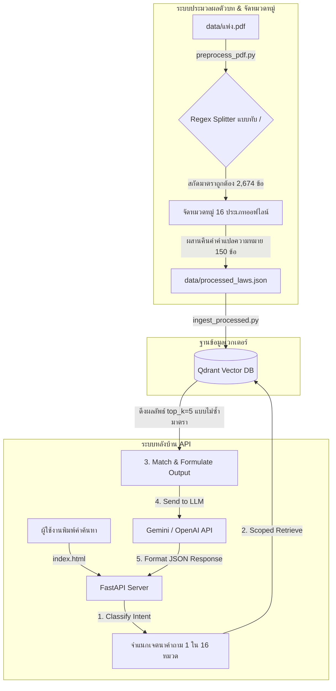

# ⚖️ LegalShield AI (AuditGuard AI)
### ระบบสืบค้นตัวบทกฎหมายแพ่งและพาณิชย์และวิเคราะห์คดีอัจฉริยะ (Semantic Search & Scoped RAG AI Assistant)

ระบบผู้ช่วยสืบค้นตัวบทกฎหมายและให้คำอธิบายเชิงปฏิบัติสำหรับประมวลกฎหมายแพ่งและพาณิชย์ของไทยจำนวน **2,674 มาตรา** ทำงานบนสถาปัตยกรรม Retrieval-Augmented Generation (RAG) พร้อมระบบจำแนกหมวดหมู่เจตนาคำค้น (Intent Classification) การกรองข้อความค้นหา (Scoped Retrieval) และการประมวลผลให้คำแนะนำทางกฎหมายอัตโนมัติด้วย **Google Gemini API** (พร้อมรองรับ OpenAI / DeepSeek เป็นระบบสำรอง) เพื่อความแม่นยำสูงสุดและลดการเกิดอาการหลอนของโมเดล (Hallucination)

---

## 🌟 จุดเด่นของโครงการ (Core Features)

1. **AI Legal Assistant & Synthesis (ระบบวิเคราะห์คดีและให้คำแนะนำด้วย AI):**
   * **ผสานพลัง LLM:** เมื่อผู้ใช้ถามคำถาม ระบบจะดึงตัวบทกฎหมายที่เกี่ยวข้องมาสืบค้นและส่งต่อให้ **Google Gemini API** (โมเดล `gemini-2.0-flash` เจาะจงรูปแบบ JSON) ร่วมวิเคราะห์
   * **คัดกรองมาตราที่ไม่เกี่ยวข้อง:** AI จะช่วยคัดเลือกและตัดมาตราที่ดึงขึ้นมาแล้วไม่เกี่ยวข้องกับเนื้อหาคดีออกให้โดยอัตโนมัติ
   * **ให้คำแนะนำเชิงปฏิบัติ:** วิเคราะห์คำถามของผู้ใช้ร่วมกับตัวบทกฎหมายจริงเพื่อสร้างคำแนะนำเชิงปฏิบัติ (เช่น สิทธิเรียกร้อง, ข้อจำกัด, หรือหลักฐานหนังสือสัญญา/สลิปโอนเงินทางแชทที่สามารถใช้สู้คดีได้จริง)

2. **Intent-based Scoped Retrieval (การกรองข้อมูลด้วยเจตนาผู้ใช้):** 
   * ระบบมีโมดูลวิเคราะห์เจตนาคำค้นหาของผู้ใช้ออฟไลน์โดยอัตโนมัติ เพื่อคัดแยกคำถามออกเป็น **16 หมวดหมู่หลัก** (เช่น ครอบครัว, มรดก, กู้ยืมเงิน, ละเมิด) และนำหมวดหมู่ที่ได้ไปสร้างเป็น `MetadataFilter` ในการค้นหาเวกเตอร์ฐานข้อมูล Qdrant ช่วยให้ดึงมาตราที่เกี่ยวข้องได้แม่นยำสูงขึ้น ป้องกันการดึงตัวบทมาตราอื่นที่คำคล้ายกันแต่คนละหมวดหมู่มาปะปน

3. **Deduplication & Explanation Filtering (การลดข้อมูลซ้ำและการแสดงผลสองระดับ):**
   * **ตัดมาตราซ้ำ:** แก้ไขปัญหาการดึงมาตราเดียวกันที่ถูกแบ่งเป็นหลาย Chunk ด้วยระบบตรวจจับและยุบรวมมาตราซ้ำที่ส่วนหลังบ้าน ทำให้ได้มาตราที่หลากหลายและตรงจุดมากยิ่งขึ้น
   * **แสดงผล 2 ระดับ:** สำหรับมาตราสำคัญ (150+ มาตรา) ระบบจะแสดงถ้อยคำตัวบทจริงควบคู่กับ **"คำอธิบายเชิงปฏิบัติและคดีตัวอย่าง (💡)"** เพื่อช่วยให้ผู้ใช้เข้าใจหลักกฎหมายง่ายขึ้น ส่วนมาตราทั่วไปที่ไม่มีคำอธิบาย ระบบจะจัดรูปแบบการแสดงเฉพาะตัวบทดิบโดยอัตโนมัติ

4. **Premium Judicial UI/UX (หน้ากากผู้ใช้งานสไตล์ศาลยุติธรรม):**
   * หน้ากากผู้ใช้งานสไตล์พิมพ์คลาสสิก (Print-inspired Cream/Navy Theme) ออกแบบโดยอิงสีกรมท่าและสีทองสัมฤทธิ์ของศาลสถิตยุติธรรมไทย ตัวอักษรคมชัดสูง สบายตา พร้อมระบบ **ลิ้นชักดึงข้อมูลจากขอบจอ (Sliding Drawers)** เมื่อผู้ใช้กดดูคำอ้างอิงของมาตราอื่น ป้องกันป๊อปอัพบดบังผลลัพธ์หลัก

5. **Robust Connection Health & Fail-safe Mode (ระบบป้องกันค้างและโหมดสาธิต):**
   * ระบบใช้กลไก `AbortController` จำกัดเวลาตรวจสอบการเชื่อมต่อ API หลังบ้านใน 2.5 วินาที หากเซิร์ฟเวอร์หลังบ้านยังไม่ได้สตาร์ท ระบบจะสลับเข้าสู่ **"โหมดสาธิตออฟไลน์ (Offline Demo Mode)"** ทันที เพื่อให้ผู้ใช้งานทดสอบการทำงานของระบบผ่านคลังข้อมูลสาธิตในเครื่องได้ทันทีโดยไม่มีอาการหน้าเว็บค้าง

---

## 🏗️ สถาปัตยกรรมระบบ (System Architecture)



---

## 🛠️ Stack เทคโนโลยีที่ใช้งาน (Tech Stack)

* **Orchestration:** [LlamaIndex](https://github.com/run-llama/llama_index) (สำหรับจัดการระบบ Vector Index & Retrievers)
* **LLM Engine:** Google Gemini SDK (`google-generativeai`) (โมเดลหลัก: `gemini-2.0-flash` พร้อม fallback ไปยัง `OpenAI` และ `DeepSeek`)
* **Vector Database:** [Qdrant](https://qdrant.tech/) (เก็บชุดเวกเตอร์ข้อมูลตัวบทกฎหมายและ Metadata)
* **Embedding Model:** `intfloat/multilingual-e5-small` (โมเดลเวกเตอร์ภาษาไทยประสิทธิภาพสูง รันแบบ Local ออฟไลน์ 100%)
* **Backend Framework:** [FastAPI](https://fastapi.tiangolo.com/) (สร้าง API สำหรับให้บริการรับส่งคำค้นหาและดึงมาตรา)
* **Containerization:** [Docker Desktop](https://www.docker.com/) (ควบคุมเซอร์วิส Qdrant)
* **Frontend:** Vanilla HTML, CSS (สไตล์ศาลยุติธรรมคลาสสิก), JavaScript (ES6)

---

## 🚀 คู่มือการติดตั้งและเริ่มใช้งาน (Setup & Run Guide)

### 1. การเตรียมความพร้อมของระบบ
ตรวจสอบให้แน่ใจว่าได้ติดตั้ง [Docker Desktop](https://www.docker.com/products/docker-desktop/) และ [Miniconda/Anaconda](https://docs.conda.io/en/latest/) บนเครื่องของคุณแล้ว

### 2. สตาร์ทเซอร์วิสฐานข้อมูลเวกเตอร์ (Qdrant)
รันคำสั่ง Docker-compose เพื่อเริ่มบริการฐานข้อมูลเวกเตอร์แบบเบื้องหลัง:
```bash
docker-compose up -d
```

### 3. ติดตั้งสภาพแวดล้อม Python และไลบรารี
```bash
# 1. สร้าง Environment ใหม่
conda create -n auditguard python=3.10 -y
conda activate auditguard

# 2. ติดตั้ง Library ทั้งหมด
pip install -r requirements.txt
```

### 4. การตั้งค่าตัวแปรสภาพแวดล้อม (Environment Variables)
สร้างไฟล์ `.env` ที่โฟลเดอร์หลักของโปรเจกต์ และใส่ API Key ของ Gemini (หรือ OpenAI / DeepSeek สำรอง):
```env
GEMINI_API_KEY=your_gemini_api_key_here
```

### 5. เปิดบริการ API และเข้าใช้งานหน้าเว็บ
1. เปิด API Server หลังบ้าน:
   ```bash
   python main.py
   ```
2. ดับเบิ้ลคลิกเปิดไฟล์ `index.html` บนเบราว์เซอร์ เพื่อเข้าใช้งานระบบสืบค้นในโหมดออนไลน์เต็มรูปแบบพร้อม AI Legal Assistant!

---

## 📁 โครงสร้างโฟลเดอร์สำหรับขึ้น GitHub (Clean Portfolio Setup)

ตัวโครงการได้รับการจัดสรรไฟล์อย่างเป็นมืออาชีพ โดยไฟล์ข้อมูลดิบ (PDF/JSON) และสคริปต์ขั้นตอนการประมวลผลข้อมูล (ETL Pipelines, Ingestion, Evaluation) จะมีอยู่ภายในเครื่องเพื่อใช้งาน แต่จะถูกกรองออกผ่าน `.gitignore` เพื่อรักษาความสะอาดของ Repository สำหรับเป็นผลงาน (Portfolio) บน GitHub:

```
auditguard_ai/
│
├── .gitignore                  # ไฟล์ละเว้นข้อมูลกฎหมายดิบและตัวจัดการ ETL
├── docker-compose.yml          # ไฟล์กำหนดเซอร์วิส Docker ของ Qdrant
├── requirements.txt            # ไฟล์รายการ Library ที่จำเป็นในการรันแอป
│
├── main.py                     # เซิร์ฟเวอร์ API หลังบ้าน (FastAPI) ประมวลผลร่วมกับ Gemini
├── index.html                  # หน้ากากผู้ใช้งานสืบค้น (ธีมทางการศาลยุติธรรม)
└── README.md                   # เอกสารคู่มือโครงการ (ฉบับนี้)
```
